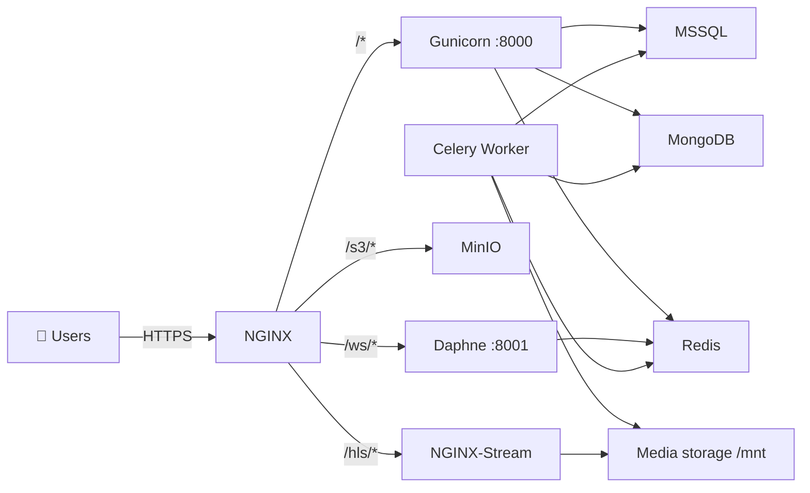

# MediaTaskDistributor: Broadcast Material Management System


A Django-based web application that extends the **Oplan3** broadcast scheduling system with
comprehensive material management, verification workflows and workforce (task) distribution tools
for the TV broadcast production pipeline (channels: Крепкое, Планета дети, Мировой сериал,
Мужской сериал, Наше детство, Романтичный сериал, Наше родное кино, Семейное кино,
Советское родное кино, Кино +, Кино Индии).


## Key Features

### Material Management
- Pulls the broadcast schedule from the Oplan3 MSSQL database and filters unverified/unreviewed content
- Builds day-organized task queues (week view, full list, material cards)
- Maintains a complete database of all materials available for assignment
- Batch operations for serial content (`task_ready_batch`, `cenz_info_change_batch`) to avoid duplicate entries
- Card locking (`block_card` / `unblock_card`) so two engineers don't edit the same material
- Censorship/CENZ workflow (`load_cenz_data`, `cenz_info_change`) and attachment handling

### Workforce Distribution
- **Automatic task assignment** based on employee KPI metrics (`distribution/distribution.py`)
- Balanced workload distribution among active team members, with inactive engineers excluded
- Manual redistribution and a common material pool (`common_pool`)
- Manager dashboard with productivity analytics and KPI charts (`home`, `admin_work_panel`)
- Employee work-time tracking via middleware (`workers/middleware.py` → `DailyWorkTime`, `UserActivity`)
- Work calendar (workdays / vacations / time off)

### Workflow Tools
- **OTK (technical control)** module for quality approval, fail and fix states
- **On-air report** with daily / monthly / per-schedule readiness views
- **Playlist** module with broadcast grids, comments and editor notifications
- **Schedule perspective** module for planning material position in future grids
- **Advanced search** — fast and full-text lookup across materials
- **Cinema Atlas** (external-only) material research tab
- **File Manager** with rclone-based large-file copy + live progress over WebSocket
- **Integrated video streaming** via NGINX-HLS (`/hls/`) and media playback probing
- Real-time notifications and per-material messenger over WebSockets
- Comprehensive logging of all file operations and automated service reports

### Media Processing (Celery)
- `ffprobe_scan` — technical metadata scan of video files
- `r128_scan` — loudness (EBU R128) analysis with GPU/CPU ffmpeg
- `copy_large_file` — async file transfer with checksum verification and progress reporting
- `cleanup_old_files` — scheduled removal of stale temporary media
- Kinopoisk metadata parser (BeautifulSoup + RapidFuzz matching) for the Cinema Atlas

## Technology Stack

| Layer | Technology |
|-------|------------|
| Language | Python 3.10 |
| Web framework | Django 5.0.13 |
| Web server | NGINX (SSL termination, static/media, HLS proxy) |
| App servers | Gunicorn (WSGI) + Daphne (ASGI/WebSocket) |
| Async tasks | Celery 5.3 + Redis 7 broker + Flower 2.0 monitoring |
| WebSockets | Django Channels + channels-redis |
| Primary DB | Microsoft SQL Server (`mssql-django` + `pyodbc`, ODBC Driver 18) |
| Document DB | MongoDB (`pymongo`) — ffmpeg/kinopoisk collections |
| Object storage | MinIO (S3) via `django-storages` + `boto3` |
| Media tooling | FFmpeg / FFprobe, rclone |
| Frontend | Django templates, Bootstrap, Bootstrap Icons, Chart.js, AJAX |
| Parsing | requests + BeautifulSoup4 + RapidFuzz |
| Containerization | Docker & Docker Compose |

## Architecture

The service is deployed across four hosts (see [`docker/ports-architecture.md`](docker/ports-architecture.md)
and [`docker/ports-table.md`](docker/ports-table.md) for the full network map):

| # | Server | Role | Key services |
|---|--------|------|--------------|
| 1 | MSSQL Server (`192.168.80.60` / `81.24.120.58`) | Shared database | MSSQL `:1433` — Oplan3 + Planner DBs |
| 2 | Streaming ST33 (`192.168.33.3`) | Media processing | Celery workers (GPU), Redis `:6379`, MongoDB `:27017`, Flower `:5555`, NGINX-Stream `:8002`, MinIO `:9000` |
| 3 | Internal Planner (`192.168.33.3`, `https://tvfab.local`) | Corporate app | NGINX `:80/:443`, Gunicorn `:8000`, Daphne `:8001` |
| 4 | External Planner (`62.181.43.194`, `https://tvfab.ru`) | Public app | NGINX `:80/:443` (Let's Encrypt), Gunicorn `:8000`, Daphne `:8001` |



## Django Apps / Modules

| App | URL prefix | Responsibility |
|-----|-----------|----------------|
| `home` | `/` | Landing page, KPI charts, calendar summary, unread counters |
| `main` | `/` | Core material cards, filters, comments, CENZ data, work calendar |
| `workers` | `/authorize/` | Login/logout, work-time middleware, user/group creation |
| `desktop` | `/desktop/` | Personal work desktop with cards, containers and name markers |
| `otk` | `/otk/` | Technical control — approve / fail / fix materials |
| `on_air_report` | `/on-air-report/` | Daily/monthly/per-schedule readiness reports + search |
| `common_pool` | `/common_pool/` | Shared material pool, stats and manual distribution |
| `distribution` | `/` | Automatic KPI-based task distribution engine |
| `playlist` | `/playlist/` | Broadcast grids, playlist status, editor notifications |
| `schedule_perspective` | `/schedule-perspective/` | Future schedule planning and program positioning |
| `advanced_search` | `/` | Fast search + advanced multi-filter search |
| `admin_work_panel` | `/task_manager/` | Manager task table, sorting, saved filters, batch actions |
| `messenger_static` | `/messenger/` | Per-material chat and notifications |
| `notifications` | `/notifications/` | In-app notification center (WebSocket push) |
| `file_manager` | `/file-manager/` | Async file copy tasks with live progress |
| `tools` | `/tools/` | Maintenance utilities, service reports, update "no material" |

## Roles & Permissions

Group membership drives the visible navigation panels (`main/settings/main_settings.py`).
Users are provisioned from `planner/workers/.users.json` via `create_users_in_groups()`.

| Group | Panel | Main tabs |
|-------|-------|-----------|
| `moderators` | Админ панель | task manager, KPI, work calendar |
| `broadcast_engineers` | Эфирный контроль | day/month report, air search, Cinema Atlas, advanced search |
| `preparation_engineers` | Инженеры подготовки | week, list, common pool, advanced search, desktop |
| `otk_engineers` | ОТК | technical control, common pool, advanced search, Cinema Atlas |
| `editors` | Редакторы | reports, common pool, playlist, editor notifications, Cinema Atlas, advanced search |
| `chief_editor` | Главный редактор | editors + advanced search |
| `preparation_engineers__editors` | Special (id 7) | combined preparation + editors access |

Material statuses run through a fixed pipeline:
`no_material → not_ready → fix → fix_ready → ready → otk → otk_fail → final → final_fail → oplan_ready`,
plus `no_task_list`, `common_pool`, `card_error`.

## Repository Layout

```
MediaTaskDistributor/
├── planner/                 # Django project
│   ├── manage.py
│   ├── planner/             # settings, urls, wsgi/asgi, celery settings, S3 storage
│   ├── <django apps>/       # see module table above
│   ├── static/              # CSS / JS / images
│   └── workers/.users.json  # seed users for provisioning
├── docker/
│   ├── internal/            # Corporate app stack (compose + Dockerfile + nginx.conf + ssl)
│   ├── external/            # Public app stack (Let's Encrypt)
│   ├── s33/                 # Internal app stack variant for the ST33 host
│   ├── streaming/           # Celery workers, Redis, MongoDB, Flower, NGINX-Stream, MinIO
│   ├── ports-architecture.md
│   ├── ports-table.md
│   ├── mongo_users_backup_restore.md
│   └── cmds.md
├── sql_scripts/             # Oplan3 / Planner SQL (init, report, rebase, checks)
├── screenshots/
├── requirements.txt                 # full web app deps
├── requirements-celery.txt          # Celery worker deps (GPU/ffmpeg)
├── requirements-filecopy.txt        # file-copy worker deps
└── README.md
```

## Deployment

### 1. Configure environment

Each stack (`docker/internal`, `docker/external`, `docker/streaming`) has an `.env.example`.
Copy it to `.env` and fill in the values.

**App stacks** (`internal`, `external`, `s33`):

| Variable | Description |
|----------|-------------|
| `DJANGO_SECRET_KEY` | Django secret key |
| `ALLOWED_HOSTS` | Comma-separated host list |
| `CSRF_TRUSTED_ORIGINS` | Comma-separated trusted origins |
| `SERVICE_TYPE` | `internal` or `external` (toggles S3 domain + external-only tabs) |
| `MEDIA_SERVER_IP` / `STREAMING_SERVER_PORT` | Streaming host for the HLS URL |
| `ODBC_DRIVER` | e.g. `ODBC Driver 17 for SQL Server` |
| `DB_MSSQL_HOST` / `DB_MSSQL_PORT` / `DB_MSSQL_USER` / `DB_MSSQL_PASSWORD` | MSSQL connection |
| `DB_MONGO_HOST` / `DB_MONGO_PORT` / `DB_MONGO_USER` / `DB_MONGO_PASSWORD` | MongoDB connection |
| `REDIS_HOST` / `REDIS_PORT` / `REDIS_PASSWORD` | Redis broker for Celery + Channels |
| `CHANNELS_REDIS_HOST` | Redis host for WebSocket channel layer |
| `USE_S3_STORAGE` / `MINIO_DJANGO_USER` / `MINIO_DJANGO_PASSWORD` / `S3_BUCKET_NAME` / `AWS_S3_ENDPOINT_URL` | MinIO/S3 storage |
| `SFTP_FOLDER` | SFTP drop folder (default `/mnt/sftp/Planner`) |

**Streaming stack** additionally uses:
`MONGO_ROOT_USERNAME` / `MONGO_ROOT_PASSWORD`, `FLOWER_PORT`, `FLOWER_USER`, `FLOWER_PASSWORD`,
`FLOWER_PREFIX`, `MINIO_ROOT_USER`, `MINIO_ROOT_PASSWORD`, `MINIO_DJANGO_USER`, `MINIO_DJANGO_PASSWORD`,
`S3_BUCKET_NAME`.

### 2. Bring the stacks up

Deploy the **app** stack (corporate or public host):

```bash
# from docker/internal (or docker/external, docker/s33)
docker-compose -p planner up -d --build
```

Deploy the **streaming / workers** stack (media server):

```bash
# from docker/streaming
docker-compose -p media up -d --build
```

Full reset (drops volumes):

```bash
docker-compose -p planner down -v --remove-orphans
docker-compose -p planner up -d --build
```

Recreate a single service, e.g. MongoDB:

```bash
docker-compose -p media up -d --force-recreate mongodb
```

### 3. Provision users (first run)

Inside the app container:

```bash
python manage.py migrate
python manage.py shell -c "from workers.create_users import create_users_in_groups; create_users_in_groups()"
```

### Celery queues

The streaming stack runs three worker processes against Redis:

| Queue | Worker container | Purpose |
|-------|------------------|---------|
| `ffmpeg`, `service` | `media_celery_worker` (GPU reservation) | ffprobe / R128 / media scanning |
| `file_copy` | `media_file_copy_worker` (CPU-limited, mounts `/mnt`) | rclone large-file copy + verification |

Celery is configured by `DJANGO_SETTINGS_MODULE=planner.celery_settings`.
Monitor tasks via **Flower** on `:5555` (basic-auth protected).

### WebSockets

Daphne serves Channels routes:

| Path | Consumer | Purpose |
|------|----------|---------|
| `/ws/notifications/` | `notifications.consumers.NotificationConsumer` | Real-time notifications |
| `/ws/file-manager/` | `file_manager.consumers.FileManagerConsumer` | File-copy progress updates |

NGINX proxies `/ws/` to Daphne and `/hls/` to the streaming server; `/s3/django-aws/` to MinIO.

### MongoDB: users, backup & restore

See [`docker/mongo_users_backup_restore.md`](docker/mongo_users_backup_restore.md) for:
- creating `internal_worker` (readWrite) and `external_listener` (read) users,
- `mongodump` / `mongorestore` inside the `media_mongodb` container,
- moving backups between hosts (`docker cp`, `scp`) and fixing volume ownership.

### SQL scripts

`sql_scripts/` contains the Oplan3/Planner schema bootstrap (`init_planner.sql`),
regular reports (`REPORT.sql`, `!regular_report.sql`), rebase fixtures and data-quality checks
(`check_bugs.sql`, `check_distribution.sql`, `check_engineers_bugs.sql`).

## Local Development

```bash
# 1. Create a virtualenv and install dependencies
python -m venv .venv
.venv\Scripts\activate            # Windows
pip install -r requirements.txt

# 2. Provide a .env with the variables listed above (DB, Redis, Mongo, S3)

# 3. Run migrations and the dev server
cd planner
python manage.py migrate
python manage.py runserver 0.0.0.0:8000
```

Requirements:
- An ODBC driver for SQL Server (`msodbcsql18` in Docker, `ODBC Driver 17` locally by default).
- Reachable Redis / MongoDB / MinIO for Celery, Channels and media storage.
- FFmpeg + rclone for the worker tasks.

## Integration Points

- Seamless connection to the existing **Oplan3 MSSQL database** (`oplan3`) using `pyodbc` / `mssql-django`.
- A separate **Planner** MSSQL database stores app-owned tables.
- Read-only access to Oplan3 schedules, with controlled write-back of verification status.
- MongoDB (`planner`, `kinopoisk` collections) backs ffmpeg scan results and metadata.
- MinIO (S3) stores generated posters, waveforms, attachments and chat files.

## Screenshots

| Home | Material list | Task manager |
|------|---------------|--------------|
|  |  |  |

## License

See [LICENSE.md](LICENSE.md).
