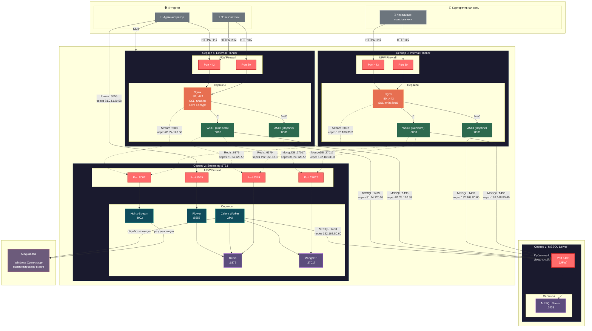

# Архитектура Planner Project

## Общая схема всех серверов и связей

```mermaid
graph TB
    subgraph Level1[" "]
        subgraph Internet["🌐 Интернет"]
            User["👤 Пользователи"]
            Admin["🔧 Администратор"]
        end

        subgraph CorpNet["🏢 Корпоративная сеть"]
            LocalUser["👥 Локальные пользователи"]
        end
    end
    
    subgraph Level2[" "]
        %% ===========================================
        %% СЕРВЕР 1: MSSQL Server
        %% ===========================================
        subgraph Server1["Сервер 1: MSSQL Server<br/> <br/>Публичный: 81.24.120.58<br/>Локальный: 192.168.80.60<br/> "]
            
            S1_FW_1433["Port 1433<br/>(UFW)"]

            subgraph S1_Services["Сервисы"]
                MSSQL["MSSQL Server<br/>:1433"]
            end
            
            S1_FW_1433 --> MSSQL
        end
    end

    subgraph Level3[" "]
        direction LR
        
        %% ===========================================
        %% СЕРВЕР 2: Streaming ST33
        %% ===========================================
        subgraph Server2["Сервер 2: Streaming ST33<br/> <br/>Публичный: 81.24.120.58<br/>Локальный: 192.168.33.3<br/> "]
            
            subgraph S2_Firewall["UFW Firewall"]
                direction LR
                S2_FW_6379["Port 6379"]
                S2_FW_5555["Port 5555"]
                S2_FW_8002["Port 8002"]
                S2_FW_27017["Port 27017"]
            end

            subgraph S2_Services["Сервисы"]
                Worker["Celery Worker<br/>GPU"]
                Flower["Flower<br/>:5555"]
                Redis["Redis<br/>:6379"]
                MongoDB["MongoDB<br/>:27017"]
                NginxStream["Nginx-Stream<br/>:8002"]
            end
            
            %% Firewall -> Сервисы
            S2_FW_6379 --> Redis
            S2_FW_5555 --> Flower
            S2_FW_8002 --> NginxStream
            S2_FW_27017 --> MongoDB
            
            %% Внутренние связи Server 2
            Worker --> Redis
            Worker --> MongoDB
            Flower --> Redis
        end
    
        %% ===========================================
        %% СЕРВЕР 3: Internal Planner
        %% ===========================================
        subgraph Server3["Сервер 3: Internal Planner<br/> <br/>192.168.33.3<br/>https://tvfab.local<br/> "]
                    
            subgraph S3_Firewall["UFW Firewall"]
                direction LR
                S3_FW_80["Port 80"]
                S3_FW_443["Port 443"]
            end

            subgraph S3_Services["Сервисы"]
                NginxInt["Nginx<br/>:80, :443<br/>SSL: tvfab.local"]
                WSGI_Int["WSGI (Gunicorn)<br/>:8000"]
                ASGI_Int["ASGI (Daphne)<br/>:8001"]
            end
            
            %% Firewall -> Nginx
            S3_FW_80 --> NginxInt
            S3_FW_443 --> NginxInt
            
            %% Nginx -> App
            NginxInt -->|/ws/*| ASGI_Int
            NginxInt -->|/*| WSGI_Int
        end
    
        %% ===========================================
        %% СЕРВЕР 4: External Planner
        %% ===========================================
        subgraph Server4["Сервер 4: External Planner<br/> <br/>62.181.43.194<br/>https://tvfab.ru<br/> "]
                    
            subgraph S4_Firewall["UFW Firewall"]
                direction LR
                S4_FW_80["Port 80"]
                S4_FW_443["Port 443"]
            end

            subgraph S4_Services["Сервисы"]
                NginxExt["Nginx<br/>:80, :443<br/>SSL: tvfab.ru<br/>Let's Encrypt"]
                WSGI_Ext["WSGI (Gunicorn)<br/>:8000"]
                ASGI_Ext["ASGI (Daphne)<br/>:8001"]
            end
            
            %% Firewall -> Nginx
            S4_FW_80 --> NginxExt
            S4_FW_443 --> NginxExt
            
            %% Nginx -> App
            NginxExt -->|/ws/*| ASGI_Ext
            NginxExt -->|/*| WSGI_Ext
        end
    end

    subgraph Level4[" "]
        Storage["Медиабаза<br/> <br/>Windows Хранилище<br/>примонтировано в /mnt<br/> "]
    end
    
    %% ===========================================
    %% ВНЕШНИЕ СВЯЗИ (Пользователи → Firewall)
    %% ===========================================
    
    %% Интернет → External Planner
    User -->|HTTPS :443| S4_FW_443
    User -->|HTTP :80| S4_FW_80
    Admin -->|HTTPS :443| S4_FW_443
    Admin -->|SSH| Server4

    %% Корп. сеть → Internal Planner
    LocalUser -->|HTTPS :443| S3_FW_443
    LocalUser -->|HTTP :80| S3_FW_80

    %% ===========================================
    %% МЕЖСЕРВЕРНЫЕ СВЯЗИ (через Firewall)
    %% ===========================================

    %% Server 3 (Internal) → Server 2 (Streaming) локально
    WSGI_Int -.->|Redis :6379<br/>через 192.168.33.3| S2_FW_6379
    WSGI_Int -.->|MongoDB :27017<br/>через 192.168.33.3| S2_FW_27017
    NginxInt -.->|Stream :8002<br/>через 192.168.33.3| S2_FW_8002

    %% Server 3 (Internal) → Server 1 (MSSQL) локально
    WSGI_Int -->|MSSQL :1433<br/>через 192.168.80.60| S1_FW_1433
    ASGI_Int -->|MSSQL :1433<br/>через 192.168.80.60| S1_FW_1433

    %% Server 4 (External) → Server 1 (MSSQL) публично
    WSGI_Ext -->|MSSQL :1433<br/>через 81.24.120.58| S1_FW_1433
    ASGI_Ext -->|MSSQL :1433<br/>через 81.24.120.58| S1_FW_1433

    %% Server 4 (External) → Server 2 (Streaming) публично
    WSGI_Ext -.->|Redis :6379<br/>через 81.24.120.58| S2_FW_6379
    WSGI_Ext -.->|MongoDB :27017<br/>через 81.24.120.58| S2_FW_27017
    NginxExt -.->|Stream :8002<br/>через 81.24.120.58| S2_FW_8002
    Admin -->|Flower :5555<br/>через 81.24.120.58| S2_FW_5555

    %% Server 2 → Server 1 (MSSQL) локально
    Worker -->|MSSQL :1433<br/>через 192.168.80.60| S1_FW_1433

    %% ===========================================
    %% СВЯЗИ С ХРАНИЛИЩЕМ
    %% ===========================================
    NginxStream -->|раздача видео| Storage
    Worker -->|обработка медиа| Storage

    %% ===========================================
    %% ПРИНУДИТЕЛЬНОЕ ВЕРТИКАЛЬНОЕ РАСПОЛОЖЕНИЕ
    %% ===========================================
    Level1 ~~~ Level2
    Level2 ~~~ Level3
    Level3 ~~~ Level4

    %% ===========================================
    %% СТИЛИ
    %% ===========================================
    classDef server fill:#1a1a2e,stroke:#16213e,color:#fff,stroke-width:3px
    classDef database fill:#5c4d7d,stroke:#9d4edd,color:#fff
    classDef streaming fill:#0f4c5c,stroke:#2a9d8f,color:#fff
    classDef app fill:#2d6a4f,stroke:#40916c,color:#fff
    classDef web fill:#e76f51,stroke:#f4a261,color:#fff
    classDef firewall fill:#ff6b6b,stroke:#c92a2a,color:#fff,stroke-width:2px
    classDef external fill:#6c757d,stroke:#adb5bd,color:#fff
    classDef storage fill:#6c5b7b,stroke:#c06c84,color:#fff

    class Server1,Server2,Server3,Server4 server
    class MSSQL,MongoDB,Redis database
    class Worker,Flower,NginxStream streaming
    class WSGI_Int,ASGI_Int,WSGI_Ext,ASGI_Ext app
    class NginxInt,NginxExt web
    class S1_FW_1433,S2_FW_6379,S2_FW_5555,S2_FW_8002,S2_FW_27017,S3_FW_80,S3_FW_443,S4_FW_80,S4_FW_443 firewall
    class User,Admin,LocalUser external
    class Storage storage
```